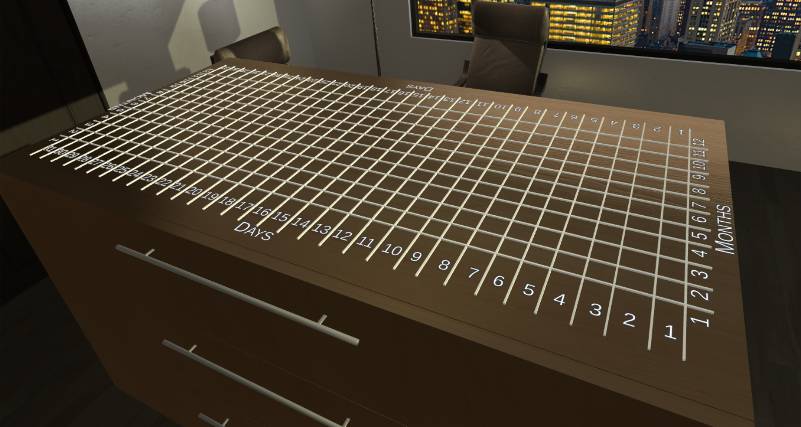

# Shrinking boundaries: Using Haptics for Enhancing Realism in Immersive Interactions with 3D Bar Charts

## Build Settings

The project utilizes [OpenHaptics](https://support.3dsystems.com/s/article/OpenHaptics-for-Windows-Developer-Edition-v35?language=en_US) plugin to provide support for a [GeoMagic Touch](https://www.3dsystems.com/haptics-devices/touch) haptic device.

To run the project, open the project with Unity Hub. (version: `2020.3.3f1`)

## Project Motivation

- Physicalized Visualizations
- Better perception
- Better cognition
- Touch Sensation Linked to lateral tactile-visual area of the brain [[1]](#references)
- Jansen et al. [[2]](#references) studied on screen and physicalized versions of bar charts
- Danyluk et al. [[3]](#references) extended this study to Virtual Reality environment
- Physicalized visualization performed better in almost both scenarios
- Need for involving physical feel in VR

## Related Work

- Prouzeau et al. Scaptics and Highlight-Planes [[4]](#references)
- Uses Filtration and vibrotactile feedback
- Wall et al. [[5]](#references) explored use of other types of haptic feedbacks such as friction

## Interaction Design

### Data Encodings

- Calgary Climate Dataset was used
- All data values used were averaged and normalized
- Temperature was used to encode the length of the bars
- For negative temperature values, different color was used on the bar
- Precipitation values were encoded with change in saturation value on the bars
- Mapped Vibrotactile feedback using Precipitation Values
- Humidity values were represented as additional in the floating canvas
- Mapped Frictional feedback using Humidity Values
- Precipitation and Humidity values were mapped to an ordinal scale with a threshold difference of 25%

### Axes Labelling

### Floating Canvas

### Spatial Perception & Filtering

### Friction and Vibrotactile Feedback

## Pilot Study

The pilot study comprises of three tasks and three scenarios, where we recruited three participants for the experiment.

### Tasks

#### TasksExtrema

> Find minimum and maximum values based on length of the bar

#### TaskQuiver

> Find difference in vibrotactile feedback for additional encoded data on five randomly selected days

#### TaskAbrasion

> Find difference in level of friction on the bars representing additional encoded data on five randomly selected days

### Scenarios

The three scenarios are as follows:

1. Baseline scenario
    - Interaction in VR with spatial movement only
2. Using Haptics
3. Using Haptics with Filtration

## Results

- Data from 3 Participants was recorded in this study
- Error computed with 95% Confidence Interval
- Overall Haptics with Filtration (HF) scenario performed better
- Haptic Spatial Perception with Filtration was the fastest scenario in TaskExtrema
- TaskQuiver also followed the same trend
- TaskAbrasion performed worse when using frictional haptic feedback as compared to baseline scenario

## User Feedback

- Participants found haptics spatial perception along with filtration as better form of interaction
- Vibrotactile feedback was also found to be helpful for encoding perceptual cues
- Participants rated Frictional Feedback the lowest among others

## Conclusion & Future Work

- Spatial perception and filtration improved access to occluded bars
- Frictional Haptics is dependant on how much force is exerted against an object
- More degree of freedom for movement in VR should also be explored
- Exploration of interaction using different dataset
- Study using a physicalized visualization as reference

## References

1. Reiner, M. (2008). Seeing through touch: The role of haptic information in visualization. Visualization: Theory and Practice in Science Education, 73–84. https://doi.org/10.1007/978-1-4020-5267-5_4
2. Y. Jansen, P. Dragicevic, and J.-D. Fekete. Evaluating the efficiency of physical visualizations. Proceedings of the SIGCHI Conference on Human Factors in Computing Systems, Apr 2013. doi: 10.1145/2470654.2481359
3. K. Danyluk, T. T. Ulusoy, W. Wei, and W. Willett. Touch and beyond: Comparing physical and virtual reality visualizations. IEEE Transactions on Visualization and Computer Graphics, Sep 2020. doi: 10.1109/tvcg.2020.3023336
4. Prouzeau, A., Cordeil, M., Robin, C., Ens, B., Thomas, B. H., & Dwyer, T. (2019). Scaptics and highlight-planes. Proceedings of the 2019 CHI Conference on Human Factors in Computing Systems. https://doi.org/10.1145/3290605.3300555
5. S. Wall and S. Brewster. Feeling what you hear. Proceedings of the SIGCHI Conference on Human Factors in Computing Systems, Apr 2006. doi: 10.1145/1124772.1124941
